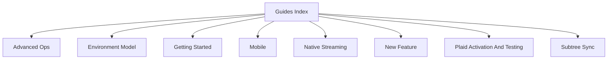

# Guides Index

## Visual Map

Practical setup and operator workflows live here.

## Guides

- [getting-started.md](./getting-started.md): first-run bootstrap and local startup.
- [advanced-ops.md](./advanced-ops.md): higher-friction operational commands and release workflows.
- [environment-model.md](./environment-model.md): supported runtime profiles and environment expectations.
- [mobile.md](./mobile.md): webapp native build and Capacitor operating model.
- [native_streaming.md](./native_streaming.md): native streaming workflow details.
- [new-feature.md](./new-feature.md): required checklist for adding a feature.
- [plaid-activation-and-testing.md](./plaid-activation-and-testing.md): Plaid activation and sandbox/live testing.
- [subtree-sync.md](./subtree-sync.md): consent-protocol subtree sync workflow.
