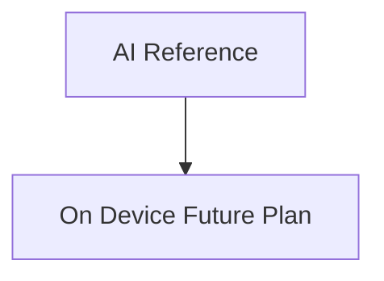

# AI Reference

## Visual Map

Cross-cutting AI strategy references live here.

## Status

`Future Plan` only. This section is planning guidance and not evidence of implemented runtime behavior.

When implementation is completed and validated, each plan doc must be replaced or promoted to production-grade reference docs with:

1. Final architecture and contract details from shipped code.
2. Measured benchmark data (not estimates).
3. Operational runbooks and ownership.

## Sections

1. [On-Device AI Future Plan](./on-device-future-plan/README.md)
