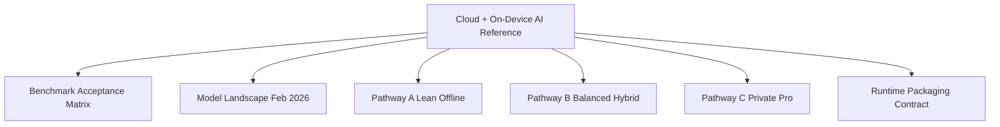

# Cloud + On-Device AI Reference

## Visual Map

## Status

`Future Plan` (pre-implementation). This directory is a planning baseline and does not imply these capabilities are already shipped.

## Promotion Rule (Plan -> Final Docs)

Convert these files into implementation docs only after all of the following are true:

1. Code paths are merged and released behind agreed rollout controls.
2. Benchmarks are measured on target devices and results are recorded.
3. API/contracts and observability events are implemented and validated.
4. Ownership, runbooks, and support boundaries are documented.

## Purpose

This section defines how Hushh keeps cloud AI as a first-class runtime while adding on-device AI as an optional offline mode.

Scope:

1. Device-tier and packaging constraints.
2. Model option landscape (SLM, OCR, STT, TTS).
3. Three decision-complete rollout pathways.
4. Runtime packaging and capability contract.
5. Benchmark and acceptance gates.

## Defaults Locked (March 2026)

1. Base app bundle target: `<= 250 MB`.
2. On-device strict support floor: upper-mid 2022+ devices.
3. On-device is additive; cloud remains primary.
4. Recommended first implementation path: `Pathway B (Balanced Hybrid)`.

## Read In Order

1. [Model Landscape (Feb 2026)](./model-landscape-feb-2026.md)
2. [Pathway A: Lean Offline](./pathway-a-lean-offline.md)
3. [Pathway B: Balanced Hybrid](./pathway-b-balanced-hybrid.md)
4. [Pathway C: Private Pro](./pathway-c-private-pro.md)
5. [Runtime Packaging Contract](./runtime-packaging-contract.md)
6. [Benchmark Acceptance Matrix](./benchmark-acceptance-matrix.md)

## Product Modes

1. `cloud` (default): current production behavior.
2. `hybrid`: local OCR/STT/TTS with cloud analysis fallback.
3. `on_device`: offline analysis from cached context + installed model packs.

## Source Baseline

Primary external references are tracked in [Model Landscape (Feb 2026)](./model-landscape-feb-2026.md#sources).
