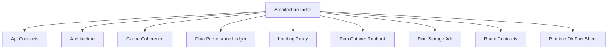

# Architecture Index

## Visual Map

Use this as the north-star entrypoint for runtime contracts and system structure.

## References

- [architecture.md](./architecture.md): end-to-end system overview.
- [api-contracts.md](./api-contracts.md): API surface and proxy/backend contracts.
- [route-contracts.md](./route-contracts.md): app route inventory and parity governance.
- [loading-policy.md](./loading-policy.md): canonical loading and empty-state policy.
- [cache-coherence.md](./cache-coherence.md): cache invalidation and freshness model.
- [runtime-db-fact-sheet.md](./runtime-db-fact-sheet.md): runtime storage facts and boundaries.
- [data-provenance-ledger.md](./data-provenance-ledger.md): provenance and audit data model.
- [pkm-cutover-runbook.md](./pkm-cutover-runbook.md): PKM cutover and compatibility rules.
