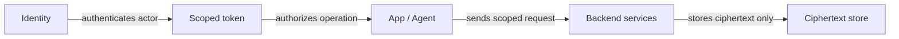
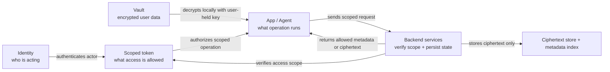
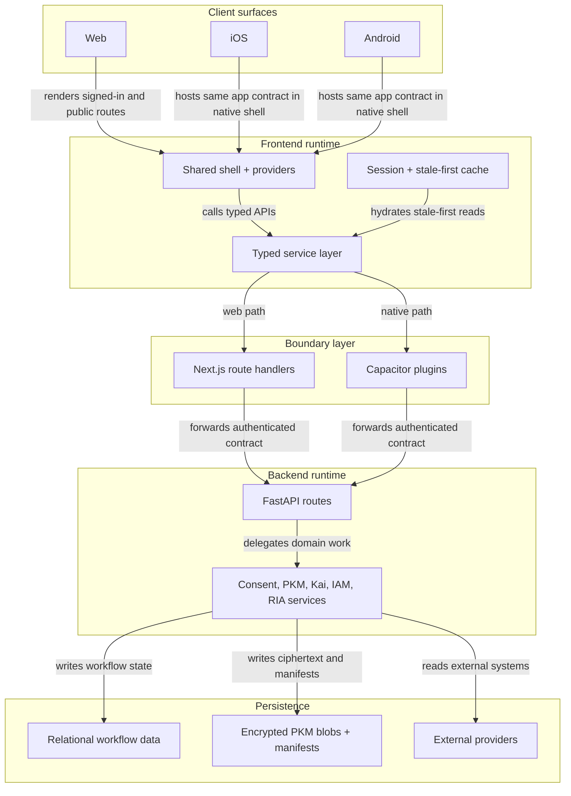

# Architecture

> Current runtime architecture for the Hushh monorepo.

## Visual Map

## Trust Model

The platform should be read as a protocol boundary first and an app stack second.

Core invariants:

1. **BYOK**: the user-controlled key boundary stays on the user side.
2. **Zero-knowledge**: the backend stores ciphertext and metadata, not plaintext user memory.
3. **Consent + scoped access**: sensitive operations require explicit scope.
4. **Tri-flow parity**: web, iOS, and Android stay contract-aligned.

## Protocol View

## Runtime View

## Repo Shape

The normal contributor mental model should stay small:

- `hushh-webapp/`: client shell, UI, service layer, native bridges
- `consent-protocol/`: backend routes, services, consent, PKM, agents
- `docs/`: cross-cutting product, architecture, and operations references

The `consent-protocol` subtree relationship still exists, but it is maintainer-only complexity and not part of the first-run contributor contract.

## What The Backend Is Responsible For

- verify consent and scope
- issue and validate token-backed access
- persist encrypted PKM blobs and metadata
- coordinate Kai, IAM, consent, and RIA workflows
- integrate with external providers without breaking the ciphertext boundary

## What The Frontend Is Responsible For

- hold the user-side trust boundary for local decryption
- maintain the session, vault, and persona state
- render the consent and scope UX clearly
- keep web, iOS, and Android aligned on visible behavior

## Design Rule

Keep the backbone integrated where the platform needs it, but make the public contributor surface feel bacterial:

- small commands
- self-contained scripts
- modular docs
- minimal cross-repo mental load
