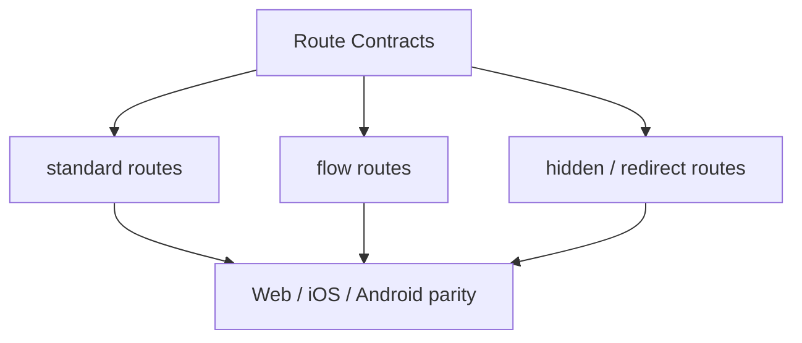

# Route Contracts

> Governance for Next.js proxy routes, native plugin parity, and app navigation truth.

## Visual Map

Hushh uses a code-owned route contract plus docs/runtime checks to keep the declared runtime surface aligned across:

- Next.js API route handlers under `hushh-webapp/app/api/**/route.ts`
- backend router prefixes and path families
- Capacitor TypeScript, iOS, and Android plugin surfaces
- mobile parity guidance for the visible page tree

## Files

- Canonical app route source: `hushh-webapp/lib/navigation/routes.ts`
- Route governance reference: `docs/reference/architecture/route-contracts.md`
- Mobile parity reference: `docs/reference/mobile/capacitor-parity-audit.md`
- Docs/runtime verification:
  - `bash scripts/ci/docs-parity-check.sh`
  - `node scripts/verify-doc-runtime-parity.cjs`

## Canonical App Routes

Keep navigation documentation aligned with `hushh-webapp/lib/navigation/routes.ts`:

- `/`
- `/developers`
- `/login`
- `/logout`
- `/labs/profile-appearance`
- `/profile`
- `/consents`
- `/marketplace`
- `/marketplace/ria`
- `/ria`
- `/ria/onboarding`
- `/ria/clients`
- `/ria/picks`
- `/ria/requests`
- `/ria/settings`
- `/kai`
- `/kai/onboarding`
- `/kai/import`
- `/kai/plaid/oauth/return`
- `/kai/investments`
- `/kai/portfolio`
- `/kai/analysis`
- `/kai/optimize`

Detail entrypoints that require an identifier use query-backed static routes so Capacitor export stays compatible:

- `/marketplace/ria?riaId=<ria_id>`
- `/ria/workspace?clientId=<investor_user_id>`

Legacy navigation surfaces and aliases must not be reintroduced without updating both `routes.ts` and this reference.

## Visible Route Coverage

`hushh-webapp/lib/navigation/routes.ts` is the declared inventory for the canonical app navigation surface. The mobile parity docs must classify visible routes as:

- native-supported
- intentionally web-only

If a route is added to the navigation contract, the corresponding architecture/mobile docs must be updated in the same change.

## When To Update Route Governance

Update the route contract docs whenever you:

- add a new Next.js API route under `hushh-webapp/app/api/`
- change a backend router prefix or supported backend path family
- add, remove, or rename a Capacitor plugin method that must exist in TS, iOS, and Android
- intentionally retire an old proxy or plugin surface

## Contract Shape

The practical contract is split across:

- `hushh-webapp/lib/navigation/routes.ts` for app-visible routes
- backend route modules and Next.js proxy handlers for API surfaces
- mobile parity docs for platform-specific expectations and exceptions

## Relationship To Other Docs

- [api-contracts.md](./api-contracts.md) describes the API surface itself.
- `hushh-webapp/lib/navigation/routes.ts` is the code-owned navigation source of truth.
- [../mobile/capacitor-parity-audit.md](../mobile/capacitor-parity-audit.md) defines the stricter mobile release gate layered on top of route contracts.
