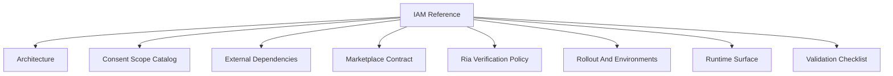

# IAM Reference

## Visual Map

This directory is the **source of truth** for Investor + RIA identity, consent IAM policy, and marketplace access contracts.

## Scope

Use this section for production-grade rules and contracts that govern:

1. Actor model (`investor`, `ria`, firm context)
2. Consent-scoped access control
3. RIA verification gate policy
4. Marketplace interaction contracts
5. Environment rollout and validation gates

## Canonical Documents

1. [IAM Architecture](./architecture.md)
2. [Consent Scope Catalog](./consent-scope-catalog.md)
3. [RIA Verification Policy](./ria-verification-policy.md)
4. [Marketplace Contract](./marketplace-contract.md)
5. [Runtime Surface](./runtime-surface.md)
6. [Rollout and Environments](./rollout-and-environments.md)
7. [Validation Checklist](./validation-checklist.md)
8. [External Dependencies](./external-dependencies.md)

## Canonical-Only Policy

1. This directory stores implemented/runtime truth only.
2. Planning drafts must not live in this directory.
3. Any IAM behavior change must update these canonical docs in the same PR.

## Core Ecosystem Alignment

IAM decisions in this directory must stay aligned with the repository core stack:

1. Agents + Operons architecture (backend DNA model)
2. MCP consent-gated data access
3. A2A delegation boundaries
4. ADK compliance checks
5. BYOK, consent-first, tri-flow invariants
