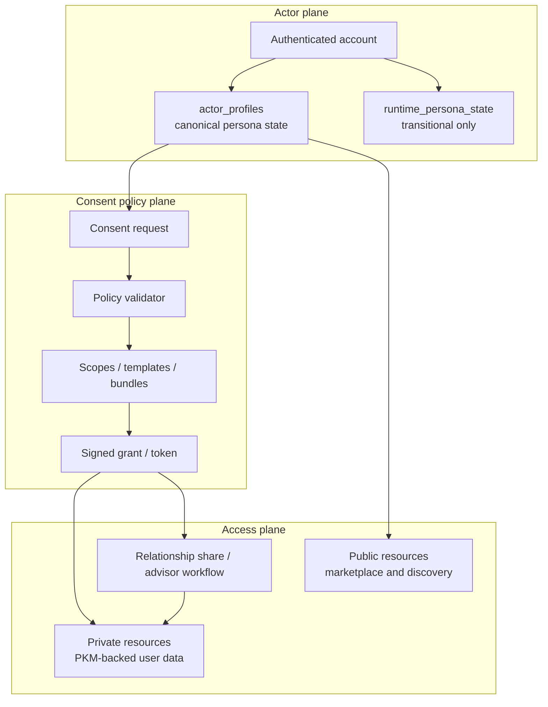

# IAM Architecture

## Visual Map

## Purpose

Define identity, actor boundaries, and consent IAM control flow for Investor + RIA experiences.

## Invariants

1. BYOK: no plaintext-at-rest for private user data.
2. Consent-first: private data access requires active consent token scope.
3. Tri-flow integrity: web, iOS, and Android must keep route/contract parity.
4. Least privilege: scopes are domain/path-specific by default.

## Actor Model

1. `investor`: subject and owner of personal financial context.
2. `ria`: advisor actor that requests scoped access.
3. `firm`: optional organizational context for advisor membership and policy.
4. `admin_ops`: operational role for verification/review workflows.

A single authenticated account may hold both `investor` and `ria` personas. Runtime defaults to `last_active_persona`.

### Persona State Model

1. `actor_profiles.last_active_persona` is the canonical persisted persona state.
2. `runtime_persona_state` is transitional compatibility state only.
3. Runtime state exists solely to preserve the "same account, entering RIA setup before full activation" path.
4. Once an account truly holds both personas, `actor_profiles` owns the persisted actor context and runtime state must not override it.

## Route Model

1. Investor route tree remains under existing Kai surfaces.
2. RIA route tree is isolated under `/ria/*`.
3. Shared discovery entry is `/marketplace` with dual-sided tabs.
4. Shared workflow hub is `/consents`.
5. `/ria/requests` is a compatibility alias into the consent center, not a first-class workflow surface.

## Consent IAM Control Plane

1. Requester submits actor-aware consent request.
2. Policy validator checks actor status, scope family, and duration bounds.
3. Investor receives pending request and can approve/deny/revoke.
4. Active token grants scoped access only to approved domains/paths.
5. Revocation and expiry immediately remove access rights.

## Ecosystem Contract Mapping

1. Agents: consume only consent-approved data slices.
2. Operons: perform business logic only after scope check in calling path.
3. MCP: external/tool access remains token-scoped and audit-backed.
4. A2A: delegated actions inherit consent boundaries; no scope escalation.
5. ADK checks: route/contract/compliance gates must pass before release.

## Public vs Private Boundary

Public discovery data may be shown in marketplace cards.
Private data is always consent-gated and scoped.

### Storage Boundary

1. Relational tables own identity, consent workflow, verification/compliance, firm membership, public discovery, and query-heavy shared market datasets.
2. `pkm_blobs` stores encrypted user-owned private content only.
3. `pkm_index` stores sanitized metadata only.
4. RIA verification/compliance and relationship workflow do not belong in the PKM.

## Change Control

Any IAM contract change must update, in the same PR:

1. This architecture doc
2. Relevant API/route contracts
3. Validation checklist
4. Dependency policy (if external provider behavior changes)
