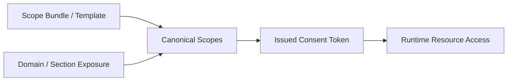

# Consent Scope Catalog

## Visual Map

## Purpose

Define canonical scope families and template policy for Investor + RIA consent requests.

## Namespace Policy

1. User-private PKM scopes use `attr.{domain}.{path}.*`.
2. Domain wildcards use `attr.{domain}.*` only when exposure rules allow the full top-level domain to be shared.
3. Relationship-share entitlements such as `ria_active_picks_feed_v1` are separate from `attr.*` PKM scopes.
4. No broad cross-domain wildcard scopes are allowed by default.

## Display Metadata Contract

Consent UIs and MCP discovery surfaces should not hand-author labels for dynamic scopes.
Scope presentation resolves from:

1. domain contracts for canonical domain display metadata
2. dynamic scope helpers for label and description generation
3. optional bundle metadata for common consent entrypoints

Expected display metadata fields:

1. `label`
2. `description`
3. `icon_name`
4. `color_hex`

## Template Catalog (V1)

| Template ID | Actor Direction | Scope Set | Default Duration |
| --- | --- | --- | --- |
| `ria_financial_summary_v1` | RIA -> Investor | `attr.financial.*`, `pkm.read` | `7d` |
| `ria_risk_profile_v1` | RIA -> Investor | `attr.financial.risk.*`, `attr.professional.*` | `7d` |
| `investor_advisor_disclosure_v1` | Investor -> RIA | `attr.ria.disclosures.*`, `attr.ria.strategy.*` | `7d` |

## Common Scope Bundles

These are UX bundles, not a second authorization system. Bundles expand into canonical scopes before consent issuance.

| Bundle Key | Intended UX Label | Representative Scope Set |
| --- | --- | --- |
| `financial_overview` | Financial Overview | `attr.financial.portfolio.*`, `attr.financial.profile.*`, `attr.financial.documents.*` |
| `full_portfolio_review` | Full Portfolio Review | `attr.financial.*` |
| `risk_assessment` | Risk Assessment | `attr.financial.profile.*`, `attr.financial.portfolio.*` |
| `health_wellness` | Health & Wellness | `attr.health.*` |
| `lifestyle_preferences` | Lifestyle Preferences | `attr.food.*`, `attr.travel.*`, `attr.entertainment.*`, `attr.shopping.*` |

## Duration Policy

1. Presets: `24h`, `7d`, `30d`, `90d`
2. Custom duration allowed up to `365d`
3. No no-expiry grants

## Validation Rules

1. Actor direction must match template policy.
2. Requested scopes must belong to allowed namespace family.
3. Requested scope must be allowlisted in the template.
4. Requests above duration cap are rejected.
5. Unverified `ria` requester is rejected.
6. Bundle-driven requests must expand to canonical scopes before token issuance.
7. Disabled PKM top-level sections must not be surfaced as discoverable scopes.

## Audit Metadata Contract

Consent request events should include:

1. `template_id`
2. `template_version`
3. `scope_count`
4. `duration_mode`
5. `duration_hours`
6. `requester_actor_type`
7. `subject_actor_type`
8. `requester_entity_id`

## Compatibility Rules

1. Keep compatibility with dynamic scope resolver conventions.
2. Never mutate historical template semantics in place.
3. Introduce new template versions with explicit migration note.
4. Deprecated legacy domain aliases may resolve to canonical PKM domains, but new callers must use the canonical keys directly.
