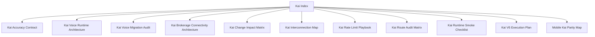

# Kai Index

## Visual Map

Kai-specific architecture, runtime, rollout, and audit references live here.

## References

- Canonical current-state references:
- [kai-interconnection-map.md](./kai-interconnection-map.md): dependency map and upstream boundaries.
- [kai-change-impact-matrix.md](./kai-change-impact-matrix.md): blast-radius guide for Kai changes.
- [kai-voice-runtime-architecture.md](./kai-voice-runtime-architecture.md): canonical current runtime architecture for Kai voice, including planner, compose, execution, settlement, and manifest/file ownership.
- [kai-brokerage-connectivity-architecture.md](./kai-brokerage-connectivity-architecture.md): brokerage and import architecture.
- [kai-accuracy-contract.md](./kai-accuracy-contract.md): accuracy and output expectations.
- [kai-route-audit-matrix.md](./kai-route-audit-matrix.md): route-level audit map.
- [kai-runtime-smoke-checklist.md](./kai-runtime-smoke-checklist.md): runtime smoke checklist.
- [kai-rate-limit-playbook.md](./kai-rate-limit-playbook.md): rate-limit handling.
- [mobile-kai-parity-map.md](./mobile-kai-parity-map.md): mobile parity map.

- Historical or plan references:
- [kai-voice-assistant-architecture.md](./kai-voice-assistant-architecture.md): original migration/audit spec for the Kai voice redesign.
- [kai-v6-execution-plan.md](./kai-v6-execution-plan.md): execution-plan artifact, not the source of truth for current runtime behavior.
