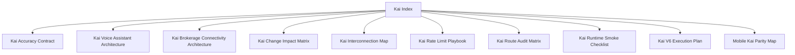

# Kai Index

## Visual Map

Kai-specific architecture, runtime, and rollout references live here.

## References

- [kai-interconnection-map.md](./kai-interconnection-map.md): dependency map and upstream boundaries.
- [kai-change-impact-matrix.md](./kai-change-impact-matrix.md): blast-radius guide for Kai changes.
- [kai-voice-assistant-architecture.md](./kai-voice-assistant-architecture.md): current-state audit, implemented closed-loop voice architecture, migration notes, and remaining compatibility shims for the Kai in-app voice assistant.
- [kai-brokerage-connectivity-architecture.md](./kai-brokerage-connectivity-architecture.md): brokerage and import architecture.
- [kai-accuracy-contract.md](./kai-accuracy-contract.md): accuracy and output expectations.
- [kai-route-audit-matrix.md](./kai-route-audit-matrix.md): route-level audit map.
- [kai-runtime-smoke-checklist.md](./kai-runtime-smoke-checklist.md): runtime smoke checklist.
- [kai-rate-limit-playbook.md](./kai-rate-limit-playbook.md): rate-limit handling.
- [mobile-kai-parity-map.md](./mobile-kai-parity-map.md): mobile parity map.
- [kai-v6-execution-plan.md](./kai-v6-execution-plan.md): currently tracked Kai execution plan.
