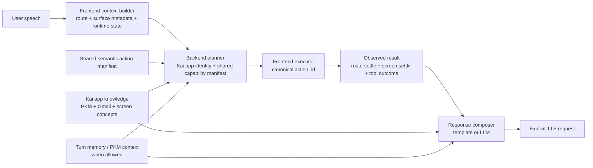

# Kai Voice Assistant Architecture

## Visual Map



Status: implemented through Phase 4 for the Kai app's in-app voice assistant, with a small set of explicit compatibility shims still gated for migration safety.

## Phase 4 Status

The closed-loop Kai voice runtime described in this document is now the default architecture in the checked-in codebase:

- canonical planner `action_id` is the normal execution authority
- frontend execution waits for observed action outcome before final speech
- route and screen settlement inform post-navigation replies
- common navigation and background acknowledgements use deterministic post-execution composition
- destructive or blocked actions respond with outcome-aware speech instead of generic powerless phrasing

Residual compatibility shims intentionally still present:

- Backend route compatibility: the backend still dual-writes legacy response fields such as `kind`, `message`, and `tool_call` alongside canonical planner fields so the current route contract remains stable during migration.
- Backend operational safety: rollout and kill-switch logic in `consent-protocol/api/routes/kai/voice.py` can still downgrade execution-capable turns to `speak_only` for canary and disablement scenarios.
- Frontend grounding fallback: `resolveGroundedVoicePlan(... allowCompatibilityFallback)` is still available only when the planner omits `action_id`, and that path emits fallback telemetry.
- Frontend speak-only fallback: `executeVoiceResponse(... allowSpeakOnlyCompatibilityFallback)` remains as an explicit opt-in escape hatch, default off, so legacy `speak_only` execution can be temporarily re-enabled only if needed.

## Purpose

This document is the implementation-ready architecture spec for the Kai in-app voice assistant. It replaces guesswork with a code-cited target design and a staged migration plan.

Product correction applied throughout this spec:

- Kai is the app.
- The voice assistant lives inside Kai.
- The assistant must speak as Kai's in-app voice interface, not as a generic external chatbot.

## Current-State Audit

| Area | Observed state | Evidence | Migration implication |
| --- | --- | --- | --- |
| Live screen context | The frontend already builds a rich structured screen context from route, published surface metadata, visible modules, runtime state, auth, vault, and available actions. | [screen-context-builder.ts](../../../hushh-webapp/lib/voice/screen-context-builder.ts#L210-L340), [kai-command-bar-global.tsx](../../../hushh-webapp/components/kai/kai-command-bar-global.tsx#L309-L480) | The redesign should reuse this context instead of inventing a second app-state model. |
| Screen metadata publication | One current surface publishes normalized voice metadata and control tracking through a singleton store. | [voice-surface-metadata.ts](../../../hushh-webapp/lib/voice/voice-surface-metadata.ts#L329-L420) | Route/screen settle checks can use this existing publication channel. |
| Frontend action model | The frontend owns a far richer action registry than the backend planner, including guards, execution policies, and expected effects. | [investor-kai-action-registry.ts](../../../hushh-webapp/lib/voice/investor-kai-action-registry.ts#L1-L220) | A shared semantic manifest should be derived from this richer model, not from the backend's smaller tool schema. |
| Frontend-internal action drift | Surface publishers already advertise `actionId`s that do not exist in the central registry, so the registry is not yet the sole frontend source of truth either. | [app/profile/page.tsx](../../../hushh-webapp/app/profile/page.tsx#L1521-L1545), [dashboard-master-view.tsx](../../../hushh-webapp/components/kai/views/dashboard-master-view.tsx#L2126-L2136), [app/kai/analysis/page.tsx](../../../hushh-webapp/app/kai/analysis/page.tsx#L500-L510), [investor-kai-action-registry.ts](../../../hushh-webapp/lib/voice/investor-kai-action-registry.ts#L127-L220) | Manifest extraction must reconcile surface-published action ids before the frontend can rely on a single canonical action catalog. |
| Backend planner identity | The backend LLM planner prompt is intentionally narrow: tool-only, no plain text, navigation mapping hints, and no durable Kai app identity. | [voice_intent_service.py](../../../consent-protocol/hushh_mcp/services/voice_intent_service.py#L1702-L1798) | Kai self-knowledge must move into a layered prompt/context system, not stay implicit. |
| Backend response contract | Backend responses are normalized into `kind`, `message`, `speak`, `execution_allowed`, optional `tool_call`, and legacy hints. | [voice_intent_service.py](../../../consent-protocol/hushh_mcp/services/voice_intent_service.py#L1800-L1838), [voice.py](../../../consent-protocol/api/routes/kai/voice.py#L2314-L2502) | The new canonical contract must dual-write during migration without breaking existing clients. |
| Deterministic fast paths | The backend resolves many intents without the LLM: screen explain, knowledge, status, some surface navigation, import/resume/cancel, and keyword navigation. | [voice_intent_service.py](../../../consent-protocol/hushh_mcp/services/voice_intent_service.py#L1960-L2415) | The target design should preserve deterministic fast paths for latency-sensitive turns. |
| Existing app knowledge | Backend knowledge entries already define PKM, Gmail connector, receipt memory, consent center, and several surface concepts. | [voice_app_knowledge.py](../../../consent-protocol/hushh_mcp/services/voice_app_knowledge.py#L149-L240) | Extend this module for Kai app identity and assistant role instead of embedding one giant prompt string. |
| Backend identity mismatch | A compat global concept still describes Kai as an in-app investor agent, which conflicts with the corrected product model that Kai is the app and the assistant lives inside it. | [voice_app_knowledge.py](../../../consent-protocol/hushh_mcp/services/voice_app_knowledge.py#L748-L756) | The identity layer must correct this language before broader prompt reuse. |
| Final speech timing | The frontend determines `finalText` before dispatch, then executes the action, then speaks the already chosen text. | [voice-turn-orchestrator.ts](../../../hushh-webapp/lib/voice/voice-turn-orchestrator.ts#L348-L468) | This is the primary reason speech can drift from real execution outcome. |
| Grounded execution path | The frontend can execute grounded actions for both `execute` and `speak_only` planner responses. | [voice-response-executor.ts](../../../hushh-webapp/lib/voice/voice-response-executor.ts#L121-L263) | `speak_only` must stop being implicitly executable on the normal path. |
| Transcript heuristics | The frontend can infer `actionId` directly from transcript patterns and prefer planner-grounded response actions only when available. | [voice-grounding.ts](../../../hushh-webapp/lib/voice/voice-grounding.ts#L153-L460) | Transcript heuristics should be demoted to explicit fallback mode only. |
| Shallow execution result | The executor returns short-term-memory eligibility, tool name, ticker, and response kind, but not a rich observed result object. | [voice-response-executor.ts](../../../hushh-webapp/lib/voice/voice-response-executor.ts#L49-L54), [voice-action-dispatcher.ts](../../../hushh-webapp/lib/voice/voice-action-dispatcher.ts#L16-L33), [command-executor.ts](../../../hushh-webapp/lib/kai/command-executor.ts#L14-L18) | A typed `VoiceActionResult` is required before post-execution speech can be accurate. |
| Rollout and kill switch | The API route preserves rollout, canary, and tool-execution kill-switch behavior, downgrading execute responses to `speak_only` when required. | [voice.py](../../../consent-protocol/api/routes/kai/voice.py#L93-L122), [voice.py](../../../consent-protocol/api/routes/kai/voice.py#L2368-L2374), [test_kai_voice_rollout_guardrails.py](../../../consent-protocol/tests/test_kai_voice_rollout_guardrails.py#L735-L779) | The redesign must preserve these operational guards. |
| Background-task placeholders | The route already exposes `ack_text`, `final_text`, `is_long_running`, and `memory_write_candidates`, but the backend service does not currently emit a meaningful `background_started` path. | [voice.py](../../../consent-protocol/api/routes/kai/voice.py#L2399-L2502), [voice_intent_service.py](../../../consent-protocol/hushh_mcp/services/voice_intent_service.py#L1960-L2415) | Background-start acknowledgements can reuse part of the existing API contract, but the service needs a real producer later. |
| Realtime behavior | Realtime auto-response is disabled; the app explicitly sends TTS instructions rather than letting the realtime model free-run. | [voice_intent_service.py](../../../consent-protocol/hushh_mcp/services/voice_intent_service.py#L1374-L1535), [voice-realtime-client.ts](../../../hushh-webapp/lib/voice/voice-realtime-client.ts#L314-L455) | Persona drift is not caused by unmanaged realtime auto-response; it comes from the planner/executor/composer split. |

## Verified Drift Symptoms

The current architecture allows speech and action to diverge in multiple ways:

1. The planner chooses spoken text before execution completes.  
   Evidence: [voice-turn-orchestrator.ts](../../../hushh-webapp/lib/voice/voice-turn-orchestrator.ts#L348-L468)

2. The frontend can execute grounded navigation even when the planner response is only `speak_only`.  
   Evidence: [voice-response-executor.ts](../../../hushh-webapp/lib/voice/voice-response-executor.ts#L152-L263), [voice-response-executor.test.ts](../../../hushh-webapp/__tests__/voice/voice-response-executor.test.ts#L290-L325)

3. The frontend still infers actions from transcript heuristics, which means execution authority is shared between planner output and client-side regex matching.  
   Evidence: [voice-grounding.ts](../../../hushh-webapp/lib/voice/voice-grounding.ts#L153-L233)

4. The backend and frontend reason over different capability sets. The backend planner allows five tool names and eight Kai commands, while the frontend registry models many more actions with guardrails and effect expectations.  
   Evidence: [voice_intent_service.py](../../../consent-protocol/hushh_mcp/services/voice_intent_service.py#L1702-L1798), [voice_intent_service.py](../../../consent-protocol/hushh_mcp/services/voice_intent_service.py#L2631-L2715), [investor-kai-action-registry.ts](../../../hushh-webapp/lib/voice/investor-kai-action-registry.ts#L1-L220)

5. The executor does not return enough information to generate outcome-aware speech.  
   Evidence: [voice-action-dispatcher.ts](../../../hushh-webapp/lib/voice/voice-action-dispatcher.ts#L16-L200), [command-executor.ts](../../../hushh-webapp/lib/kai/command-executor.ts#L53-L163)

These are design-level causes, not just isolated bugs.

## Missing or Broken References Discovered During Audit

- `hushh-webapp/lib/voice/investor-kai-action-registry.ts` references a historical `voice-navigation-architecture-plan.md` document in multiple `mapReferences` entries, but that document does not exist in the current repository snapshot.  
  Evidence: [investor-kai-action-registry.ts](../../../hushh-webapp/lib/voice/investor-kai-action-registry.ts#L159-L192) and a repo search during this audit returned no `voice-navigation-architecture-plan.md` file.

This spec intentionally does not recreate that missing file. It is recorded here as historical drift.

## Root-Cause Analysis

### 1. Identity is under-specified

The backend planner prompt describes a "Kai voice intent planner" that must emit tool calls, but it does not provide durable Kai app identity, assistant role, product scope, or capability boundaries beyond a narrow tool list.  
Evidence: [voice_intent_service.py](../../../consent-protocol/hushh_mcp/services/voice_intent_service.py#L1705-L1719)

### 2. Capability knowledge is split

The frontend registry knows actions, risks, guards, and expected effects, but the backend planner does not consume the same model.  
Evidence: [investor-kai-action-registry.ts](../../../hushh-webapp/lib/voice/investor-kai-action-registry.ts#L44-L127), [voice_intent_service.py](../../../consent-protocol/hushh_mcp/services/voice_intent_service.py#L2631-L2715)

### 3. Execution authority is split

Planner output can imply one thing, while the frontend transcript-grounding layer can infer and execute another.  
Evidence: [voice-grounding.ts](../../../hushh-webapp/lib/voice/voice-grounding.ts#L218-L460), [voice-grounding.test.ts](../../../hushh-webapp/__tests__/voice/voice-grounding.test.ts#L166-L200)

### 4. The voice loop is open-loop, not closed-loop

The system does not execute, observe, and then speak. It plans a message, dispatches an action, and usually speaks the preselected message.  
Evidence: [voice-turn-orchestrator.ts](../../../hushh-webapp/lib/voice/voice-turn-orchestrator.ts#L348-L468)

### 5. Navigation completion is not a first-class observed outcome

The executor pushes routes and logs telemetry, but it does not return a typed route/screen settlement result.  
Evidence: [voice-response-executor.ts](../../../hushh-webapp/lib/voice/voice-response-executor.ts#L187-L263)

## Target Architecture

The target design is a closed-loop voice runtime:

1. User speaks.
2. Frontend builds live app context.
3. Backend planner decides whether to answer, clarify, execute-and-wait, or start-in-background.
4. Planner returns a canonical plan anchored on `action_id`.
5. Frontend executes that exact `action_id`.
6. Frontend observes route/screen/tool outcome and emits `VoiceActionResult`.
7. Final response is composed from the real outcome.
8. TTS speaks the composed response.

### Turn Modes

| Mode | Meaning | Example turns | Speech timing |
| --- | --- | --- | --- |
| `answer_now` | No side effect required; answer from current knowledge/context. | "What is PKM?", "What can I do here?", "What is on this screen?" | Immediate |
| `execute_and_wait` | Action must complete or settle before final speech. | "Take me to profile", "Open Gmail and tell me what I can do here" | After action result and route/screen settlement |
| `start_background_and_ack` | Long-running task starts asynchronously; only startup confirmation is required before speech. | "Analyze Nvidia", "Resume active analysis", "Start portfolio import" | After start confirmation |
| `clarify` | Request is ambiguous, unsafe, or missing required slots. | ambiguous ticker, unclear destination | Immediate clarification |

## Shared Capability Manifest Strategy

### Recommendation

Adopt a neutral, repo-owned semantic manifest as the source of truth, consumed by both Python and TypeScript.

### Proposed source-of-truth shape

- Canonical manifest file: `contracts/kai/voice-action-manifest.v1.json`
- Backend loader: a small voice-manifest adapter under the existing backend voice service family
- Frontend loader: a small voice-manifest adapter under the existing frontend voice library

### Why this shape

- Python does not parse TypeScript source text.
- Frontend and backend read the same semantic action definitions.
- Runtime-specific bindings can remain local adapters keyed by `action_id`.

### Semantic fields owned by the shared manifest

- `action_id`
- `label`
- `meaning`
- `aliases`
- `scope.screens`
- `scope.routes`
- `guards`
- `risk.execution_policy`
- `completion_mode`
- `expected_effects`
- `background_behavior`

### Runtime-specific adapters that remain local

- Frontend execution bindings:
  - `router.push`
  - `executeKaiCommand`
  - `dispatchVoiceToolCall`
- Backend planning/tool exposure:
  - planner alias lookup
  - slot extraction rules
  - guard reasoning helpers

This keeps the manifest semantic and stable while preventing frontend implementation details from leaking into Python.

## Kai Identity and Knowledge Layer

The planner and composer should both inherit the same layered Kai context:

1. **Kai app identity layer**
   - The assistant is the voice interface inside the Kai app.
   - Kai helps with investor profile optimization and personalized investor guidance.
   - The assistant can explain screens, navigate inside Kai, start approved in-app actions, and use connected/personal context only when allowed.

2. **Shared capability layer**
   - Actions from the shared manifest
   - Guards and execution policy
   - Current screen-specific action availability

3. **Dynamic live context layer**
   - current screen
   - visible modules
   - active section/tab
   - auth/vault state
   - active analysis/import state

4. **Knowledge layer**
   - existing PKM/Gmail/receipt/consent concepts in [voice_app_knowledge.py](../../../consent-protocol/hushh_mcp/services/voice_app_knowledge.py#L149-L240)
   - new Kai app identity entries
   - current surface concepts

5. **Optional personal context layer**
   - short-term turn memory
   - retrieved PKM context
   - only when policy and task require it

## Proposed Contracts

### Planner Output

```ts
type VoiceTurnMode =
  | "answer_now"
  | "execute_and_wait"
  | "start_background_and_ack"
  | "clarify";

type CanonicalVoicePlan = {
  schema_version: "kai_voice_plan.v1";
  turn_id: string;
  response_id: string;
  mode: VoiceTurnMode;
  action: null | {
    action_id: string;
    slots: Record<string, string | number | boolean | null>;
    guards: Array<{
      id: string;
      status: "satisfied" | "blocked" | "unknown";
      detail?: string | null;
    }>;
    completion: "none" | "route_settle" | "screen_settle" | "background_start";
  };
  reply_strategy: {
    style: "template" | "llm";
    requires_post_execution_result: boolean;
  };
  answer: null | {
    text: string;
    source: "deterministic" | "llm";
  };
  clarification: null | {
    reason:
      | "stt_unusable"
      | "ticker_ambiguous"
      | "ticker_unknown"
      | "intent_ambiguous"
      | "guard_blocked";
    prompt: string;
    options?: string[];
  };
  legacy: {
    response_kind: string;
    tool_call?: Record<string, unknown> | null;
    execution_allowed: boolean;
    final_text: string;
    ack_text?: string | null;
  };
};
```

### Executor Input

```ts
type VoiceExecutionInput = {
  turn_id: string;
  response_id: string;
  transcript: string;
  plan: CanonicalVoicePlan;
  pre_action_context: StructuredScreenContext;
  user_id: string;
  vault_owner_token?: string;
  vault_key?: string;
  allow_fallback_grounding: boolean;
};
```

Normal-path rule:

- If `plan.action` exists, execution must use `action_id`.
- Transcript grounding may only run when `allow_fallback_grounding === true` and the canonical plan is absent or invalid.

### VoiceActionResult

```ts
type VoiceActionResult = {
  turn_id: string;
  response_id: string;
  action_id: string;
  status: "succeeded" | "started" | "blocked" | "failed" | "noop";
  route_before: string | null;
  route_after: string | null;
  screen_before: string | null;
  screen_after: string | null;
  settled_by: "none" | "route" | "screen" | "background_start" | "timeout";
  result_summary: string;
  data?: Record<string, unknown>;
  error_code?: string | null;
};
```

### Post-Execution Response Composition Input

```ts
type VoiceComposeInput = {
  transcript: string;
  plan: CanonicalVoicePlan;
  pre_action_context: StructuredScreenContext;
  post_action_context?: StructuredScreenContext | null;
  action_result?: VoiceActionResult | null;
  kai_identity: {
    app_name: "Kai";
    assistant_role: "in_app_voice_interface";
  };
  knowledge_context?: {
    concepts: string[];
    screen_summary?: string | null;
  };
  memory_context?: {
    short_term?: unknown[];
    retrieved?: unknown[];
  };
};
```

### Response Composition Rules

- Use deterministic templates for:
  - navigation success
  - blocked guards
  - unavailable/manual-only actions
  - background-start success
  - simple status responses
- Use LLM composition for:
  - combined navigation-plus-explanation turns
  - richer explainers based on post-action screen state
  - ambiguous clarifications that need natural phrasing

## Route and Screen Settlement Rules

Navigation turns in `execute_and_wait` mode must not speak final output until settlement succeeds or times out.

### Settle order

1. Capture `route_before` and `screen_before`.
2. Execute the action.
3. Watch for route change.
4. Re-derive screen identity using [route-screen-derivation.ts](../../../hushh-webapp/lib/voice/route-screen-derivation.ts#L19-L99).
5. Wait for matching surface metadata publication when the action expects a richer destination surface.
6. Build `post_action_context`.
7. Compose final speech.

### Timeout rule

- Use a bounded timeout only as a fallback.
- If timeout fires, record `settled_by: "timeout"` and produce a conservative response such as "I opened the destination, but the screen did not fully confirm in time."

## Legacy and Drift Paths To Remove or Demote

The following paths should not remain on the normal path after migration:

1. `speak_only` responses that can still execute navigation or tool steps.  
   Evidence: [voice-response-executor.ts](../../../hushh-webapp/lib/voice/voice-response-executor.ts#L152-L263), [voice-response-executor.test.ts](../../../hushh-webapp/__tests__/voice/voice-response-executor.test.ts#L290-L325)

2. Transcript-first action inference as an execution authority.  
   Evidence: [voice-grounding.ts](../../../hushh-webapp/lib/voice/voice-grounding.ts#L153-L233)

3. Preselected final speech before dispatch outcome exists.  
   Evidence: [voice-turn-orchestrator.ts](../../../hushh-webapp/lib/voice/voice-turn-orchestrator.ts#L348-L468)

4. Backend-only tool schema as the effective capability model.  
   Evidence: [voice_intent_service.py](../../../consent-protocol/hushh_mcp/services/voice_intent_service.py#L1702-L1798), [voice_intent_service.py](../../../consent-protocol/hushh_mcp/services/voice_intent_service.py#L2631-L2715)

These may remain temporarily as migration shims, but only behind explicit fallback gates and telemetry.

## Migration Plan

### Phase 1: Identity and Canonical Plan Contract

- Add a Kai app identity layer to backend voice prompt building.
- Extend `voice_app_knowledge.py` with Kai app identity and assistant-role concepts.
- Add canonical planner fields (`mode`, `action_id`, `slots`, `guards`, `reply_strategy`) while keeping legacy route payload fields intact.

### Phase 2: Shared Semantic Manifest

- Extract semantic action data from the current frontend registry into a neutral manifest.
- Keep frontend runtime binding tables local and keyed by `action_id`.
- Load the same manifest in Python and TypeScript.

### Phase 3: Result-Aware Execution

- Introduce `VoiceActionResult`.
- Execute canonical `action_id` on the frontend.
- Add route/screen settlement and observed result capture.

### Phase 4: Post-Execution Response Composition

- Move final speech composition after execution for `execute_and_wait`.
- Keep fast deterministic templates for simple outcomes.
- Use LLM composition only where richer synthesis is needed.

### Phase 5: Drift Cleanup

- Demote transcript heuristics to fallback-only mode.
- Remove the default path where `speak_only` can still execute actions.
- Align tests with the closed-loop contract.

### Phase 6: Rollout and Compatibility Cleanup

- Keep kill-switch and rollout guards intact throughout migration.
- Remove legacy fields only after one stable compatibility window and test evidence.

## Test Strategy

### Preserve existing coverage

- Backend execute-message contract for navigation: [test_kai_voice_contract.py](../../../consent-protocol/tests/test_kai_voice_contract.py#L936-L962)
- Backend kill-switch downgrade: [test_kai_voice_rollout_guardrails.py](../../../consent-protocol/tests/test_kai_voice_rollout_guardrails.py#L735-L779)
- Frontend `speak_only` navigation drift proof: [voice-response-executor.test.ts](../../../hushh-webapp/__tests__/voice/voice-response-executor.test.ts#L290-L325)
- Frontend planner-vs-transcript divergence proof: [voice-grounding.test.ts](../../../hushh-webapp/__tests__/voice/voice-grounding.test.ts#L166-L200)

### New required coverage

1. **Planner contract tests**
   - canonical `action_id`
   - turn modes
   - guard statuses
   - Kai identity prompt presence

2. **Manifest parity tests**
   - semantic manifest loader parity in Python and TypeScript
   - no orphaned `action_id`s in frontend execution adapters

3. **Executor tests**
   - `VoiceActionResult` generation
   - route settle success
   - screen settle success
   - timeout fallback
   - background-start ack behavior

4. **Composer tests**
   - navigation success wording from observed result
   - navigation-plus-explanation from post-action context
   - blocked/manual-only wording

5. **Regression scenarios**
   - "Who are you?"
   - "What can you do here?"
   - "Take me to my profile"
   - "Open Gmail"
   - "Open receipts and explain this screen"
   - "Analyze Nvidia"

## Rollback and Compatibility Considerations

1. Keep legacy `response`, `tool_call`, `execution_allowed`, `final_text`, and `ack_text` fields until the new frontend path is fully adopted.  
   Evidence: [voice.py](../../../consent-protocol/api/routes/kai/voice.py#L2478-L2502)

2. Preserve rollout and tool-execution kill-switch behavior during every migration phase.  
   Evidence: [voice.py](../../../consent-protocol/api/routes/kai/voice.py#L2368-L2374)

3. Preserve deterministic explain/status fast paths as long as they are mapped into the new turn modes instead of bypassing the canonical planner contract.  
   Evidence: [voice_intent_service.py](../../../consent-protocol/hushh_mcp/services/voice_intent_service.py#L2041-L2365)

4. During dual-write, prefer new canonical fields when present and keep transcript heuristics behind explicit fallback telemetry only.

## Recommended Implementation Order

1. Add Kai identity/prompt layering and canonical planner fields.
2. Introduce the shared semantic manifest.
3. Add `VoiceActionResult` plus route/screen settlement.
4. Move final speech composition after execution.
5. Remove or demote legacy heuristic execution paths.

## Highest-Risk Migration Areas

1. **Shared-manifest extraction without breaking frontend execution bindings**  
   The current registry mixes semantic action definitions with frontend runtime wiring. Splitting those cleanly is the most important structural step.

2. **Navigation settle behavior on real signed-in surfaces**  
   Route change alone is not enough; some turns need surface metadata confirmation before speech.

3. **Dual-write compatibility while replacing open-loop speech timing**  
   The API route and frontend currently assume legacy fields and preselected `final_text`; migration must keep existing kill switches and rollout paths stable while the closed-loop model lands.
