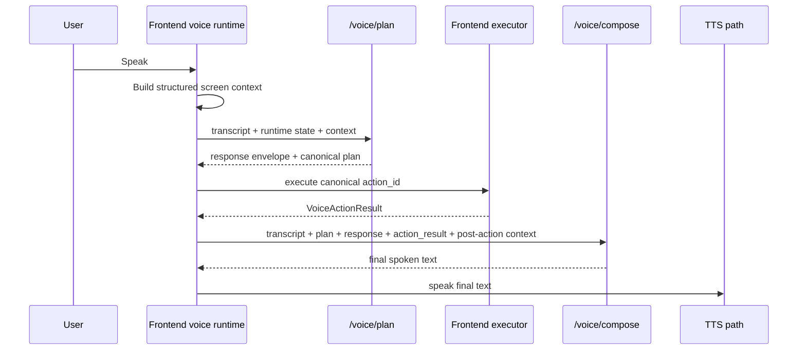

# Kai Voice Runtime Architecture

## Visual Map



Status: canonical current-state reference for the Kai app's in-app voice assistant.

## Purpose

This document describes how the Kai voice runtime works in the checked-in codebase today.

Product truth:

- Kai is the app.
- The voice assistant lives inside Kai.
- The assistant should speak as Kai's in-app voice interface, not as a generic external assistant.

Use this file as the maintained architecture reference. The older [kai-voice-assistant-architecture.md](./kai-voice-assistant-architecture.md) remains useful as the original migration/audit document, but it is no longer the best source for current runtime behavior.

## Source Of Truth

The maintained voice implementation is spread across these canonical surfaces:

- Shared semantic manifest: [contracts/kai/voice-action-manifest.v1.json](../../../contracts/kai/voice-action-manifest.v1.json)
- Frontend registry and loaders:
  - [hushh-webapp/lib/voice/investor-kai-action-registry.ts](../../../hushh-webapp/lib/voice/investor-kai-action-registry.ts)
  - [hushh-webapp/lib/voice/voice-action-manifest.ts](../../../hushh-webapp/lib/voice/voice-action-manifest.ts)
- Frontend runtime:
  - [hushh-webapp/lib/voice/voice-turn-orchestrator.ts](../../../hushh-webapp/lib/voice/voice-turn-orchestrator.ts)
  - [hushh-webapp/lib/voice/voice-grounding.ts](../../../hushh-webapp/lib/voice/voice-grounding.ts)
  - [hushh-webapp/lib/voice/voice-response-executor.ts](../../../hushh-webapp/lib/voice/voice-response-executor.ts)
  - [hushh-webapp/lib/voice/voice-action-dispatcher.ts](../../../hushh-webapp/lib/voice/voice-action-dispatcher.ts)
  - [hushh-webapp/lib/voice/voice-action-settlement.ts](../../../hushh-webapp/lib/voice/voice-action-settlement.ts)
  - [hushh-webapp/lib/voice/voice-response-composer.ts](../../../hushh-webapp/lib/voice/voice-response-composer.ts)
  - [hushh-webapp/lib/kai/command-executor.ts](../../../hushh-webapp/lib/kai/command-executor.ts)
- Frontend context and UI entrypoints:
  - [hushh-webapp/lib/voice/screen-context-builder.ts](../../../hushh-webapp/lib/voice/screen-context-builder.ts)
  - [hushh-webapp/lib/voice/voice-surface-metadata.ts](../../../hushh-webapp/lib/voice/voice-surface-metadata.ts)
  - [hushh-webapp/components/kai/kai-command-bar-global.tsx](../../../hushh-webapp/components/kai/kai-command-bar-global.tsx)
  - [hushh-webapp/components/kai/kai-search-bar.tsx](../../../hushh-webapp/components/kai/kai-search-bar.tsx)
- Backend runtime:
  - [consent-protocol/api/routes/kai/voice.py](../../../consent-protocol/api/routes/kai/voice.py)
  - [consent-protocol/hushh_mcp/services/voice_intent_service.py](../../../consent-protocol/hushh_mcp/services/voice_intent_service.py)
  - [consent-protocol/hushh_mcp/services/voice_prompt_builder.py](../../../consent-protocol/hushh_mcp/services/voice_prompt_builder.py)
  - [consent-protocol/hushh_mcp/services/voice_action_manifest.py](../../../consent-protocol/hushh_mcp/services/voice_action_manifest.py)
  - [consent-protocol/hushh_mcp/services/voice_app_knowledge.py](../../../consent-protocol/hushh_mcp/services/voice_app_knowledge.py)

## Runtime Flow

The current runtime is a closed-loop hybrid flow:

1. Speech enters the frontend voice runtime.
2. The frontend builds live route, screen, runtime, auth, vault, and surface metadata context.
3. The frontend calls `/voice/plan`.
4. The backend planner returns both:
   - a legacy-compatible response envelope
   - canonical planner fields such as `mode`, `action_id`, `slots`, `guards`, and `reply_strategy`
5. The frontend grounds and executes the canonical plan.
6. The executor emits a typed `VoiceActionResult`.
7. The frontend rebuilds post-action screen context.
8. When the plan requests LLM-backed final speech, the frontend calls `/voice/compose`.
9. The composed or fallback text is spoken through the active TTS path.

The canonical plan modes are:

- `answer_now`
- `execute_and_wait`
- `start_background_and_ack`
- `clarify`

## Backend Architecture

### Prompt and identity layers

The backend uses layered prompt/context construction instead of one inline prompt string.

- [voice_prompt_builder.py](../../../consent-protocol/hushh_mcp/services/voice_prompt_builder.py) builds shared planner/composer context
- [voice_app_knowledge.py](../../../consent-protocol/hushh_mcp/services/voice_app_knowledge.py) provides Kai identity, PKM/Gmail/receipt concepts, and global knowledge summaries
- [voice_action_manifest.py](../../../consent-protocol/hushh_mcp/services/voice_action_manifest.py) loads the shared semantic action data used by prompt selection

Planner context currently includes:

- Kai role summary and guardrails
- relevant manifest actions for the current screen and transcript
- runtime state
- global concept summaries

Composer context reuses the same layers and adds:

- transcript
- canonical plan payload
- response payload
- observed `action_result`

### Planning and response normalization

[voice_intent_service.py](../../../consent-protocol/hushh_mcp/services/voice_intent_service.py) owns:

- realtime/STT/TTS upstream calls
- deterministic fast paths
- LLM planning
- tool-call validation
- canonical-plan normalization
- post-execution response composition

Important current behavior:

- deterministic fast paths still exist for low-latency explain/status/navigation turns
- the LLM still plans through a tool-call schema, then canonical fields are normalized afterward
- canonical plan data is first-class in the current route contract
- legacy response fields are still dual-written for compatibility

### Routes

[voice.py](../../../consent-protocol/api/routes/kai/voice.py) exposes multiple voice surfaces. The main runtime routes are:

- `/voice/plan`
- `/voice/compose`
- `/voice/tts`
- `/voice/stt`
- `/voice/realtime/session`
- `/voice/capability`

`/voice/plan` is the main planning transport and still preserves rollout, canary, and kill-switch behavior.

`/voice/compose` is the post-execution response-composition transport. It receives:

- transcript
- response envelope
- canonical plan fields
- `action_result`
- runtime state
- structured screen context after execution

and calls `compose_voice_reply(...)` in [voice_intent_service.py](../../../consent-protocol/hushh_mcp/services/voice_intent_service.py).

## Frontend Architecture

### Context building

The frontend creates the structured voice context from:

- route state
- current screen identity
- surface metadata
- visible controls/actions
- auth/vault/runtime state
- short-term and retrieved memory when available

Key files:

- [screen-context-builder.ts](../../../hushh-webapp/lib/voice/screen-context-builder.ts)
- [voice-surface-metadata.ts](../../../hushh-webapp/lib/voice/voice-surface-metadata.ts)
- [kai-command-bar-global.tsx](../../../hushh-webapp/components/kai/kai-command-bar-global.tsx)
- [kai-search-bar.tsx](../../../hushh-webapp/components/kai/kai-search-bar.tsx)

### Grounding and execution

The normal execution path is canonical-plan first:

- [voice-grounding.ts](../../../hushh-webapp/lib/voice/voice-grounding.ts) prefers planner-provided `action_id`
- transcript heuristics remain only as compatibility fallback
- [voice-response-executor.ts](../../../hushh-webapp/lib/voice/voice-response-executor.ts) and [voice-action-dispatcher.ts](../../../hushh-webapp/lib/voice/voice-action-dispatcher.ts) execute the grounded action
- [command-executor.ts](../../../hushh-webapp/lib/kai/command-executor.ts) returns typed execution outcomes

### Settlement and final speech

[voice-action-settlement.ts](../../../hushh-webapp/lib/voice/voice-action-settlement.ts) waits for:

- route change
- expected screen identity
- meaningful surface metadata

before a navigation turn is treated as settled.

[voice-turn-orchestrator.ts](../../../hushh-webapp/lib/voice/voice-turn-orchestrator.ts) then:

1. dispatches the action
2. captures `VoiceActionResult`
3. rebuilds post-action context
4. calls `/voice/compose` when `reply_strategy === "llm"`
5. falls back to [voice-response-composer.ts](../../../hushh-webapp/lib/voice/voice-response-composer.ts) only when needed

The important correction from the older architecture is that the normal path is now `plan -> execute -> observe -> compose -> speak`.

## Shared Manifest And Contracts

### Shared semantic manifest

The shared source of truth for canonical actions is [contracts/kai/voice-action-manifest.v1.json](../../../contracts/kai/voice-action-manifest.v1.json).

It is consumed by:

- backend loader: [voice_action_manifest.py](../../../consent-protocol/hushh_mcp/services/voice_action_manifest.py)
- frontend loader: [voice-action-manifest.ts](../../../hushh-webapp/lib/voice/voice-action-manifest.ts)

The frontend registry still owns the richer runtime wiring and UI-oriented semantics. The JSON manifest is the shared semantic contract, not the entire runtime binding surface.

### Canonical plan fields

The current frontend/backend contract recognizes:

- `schema_version`
- `mode`
- `action_id`
- `slots`
- `guards`
- `reply_strategy`
- `clarification`
- `action_completion`

Types live in [voice-types.ts](../../../hushh-webapp/lib/voice/voice-types.ts). Validation lives in [voice-json-validator.ts](../../../hushh-webapp/lib/voice/voice-json-validator.ts).

### VoiceActionResult

The current typed observed result includes:

- `status`
- `action_id`
- `route_before`
- `route_after`
- `screen_before`
- `screen_after`
- `settled_by`
- `result_summary`
- optional structured `data`

This is the contract shared by the backend composer path and the deterministic fallback composer.

## Voice Navigation And Analysis Surfaces

The primary navigation and analysis actions are defined in:

- [investor-kai-action-registry.ts](../../../hushh-webapp/lib/voice/investor-kai-action-registry.ts)
- [contracts/kai/voice-action-manifest.v1.json](../../../contracts/kai/voice-action-manifest.v1.json)

Important current voice surfaces include:

- Kai home / market
- portfolio dashboard
- analysis workspace
- analysis history
- import
- profile
- Gmail receipts
- PKM / PKM Agent Lab
- consent center

Important analysis actions include:

- `analysis.start`
- `analysis.resume_active`
- `analysis.cancel_active`

## Observability And Debugging

Current voice debugging spans both frontend and backend.

Backend:

- `/voice/plan` tracing and latency metrics
- `/voice/compose` tracing and latency metrics
- rollout/canary/kill-switch decisions in the route layer

Frontend:

- `stt`
- `planner`
- `dispatch`
- `tts`
- `ui_fsm`

These stage names line up with the current voice debug overlay and recent-event payloads.

## Remaining Compatibility Shims

The current runtime is implemented, but a few compatibility shims remain intentional:

- backend still dual-writes legacy response fields such as `kind`, `message`, and `tool_call`
- rollout/kill-switch logic can still downgrade execution-capable turns to `speak_only`
- `resolveGroundedVoicePlan(... allowCompatibilityFallback)` still exists for planner payloads that omit `action_id`
- `executeVoiceResponse(... allowSpeakOnlyCompatibilityFallback)` still exists as an opt-in escape hatch, default off
- deterministic fast paths still coexist with the LLM planner for latency-sensitive turns

These are compatibility measures, not the main architecture.

## Known Drift To Watch

The main documentation/code drift found during this refresh:

- some in-code `mapReferences` still pointed at a deleted historical voice-navigation planning doc
- the older migration/audit doc still described several pre-implementation problems as if they were current state
- `/voice/understand` remains a legacy combined surface and does not expose the richest canonical route contract
- screen identifiers still drift across route derivation, command execution, surface publishers, and manifest expectations, which can cause settlement to fall back to timeout on otherwise successful navigations
- some surface-published action IDs are still freer-form than the central registry, so action availability context is not yet perfectly canonical

## Maintainer Checklist

When changing Kai voice behavior:

1. update the frontend registry and the shared manifest together
2. keep backend route contracts, frontend types, and validators aligned
3. update this document when the canonical runtime flow or shared contract changes
4. update the historical audit doc only when its migration notes need correction, not as the main runtime source

## Verification

Minimum verification for docs-only changes:

```bash
./bin/hushh docs verify
python3 .codex/skills/docs-governance/scripts/doc_inventory.py tier-a
```

If the shared manifest or voice registry changes, also run:

```bash
cd hushh-webapp && npm test -- __tests__/voice/voice-action-manifest.test.ts __tests__/voice/investor-kai-action-registry.test.ts
```

If backend voice routes or planner/composer contracts change, also run the focused backend voice suites.

## Related References

- [kai-voice-assistant-architecture.md](./kai-voice-assistant-architecture.md)
- [kai-route-audit-matrix.md](./kai-route-audit-matrix.md)
- [kai-runtime-smoke-checklist.md](./kai-runtime-smoke-checklist.md)
- [env-and-secrets.md](../operations/env-and-secrets.md)
