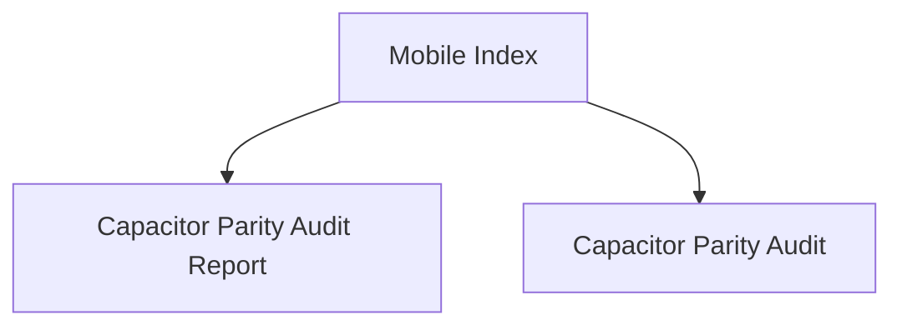

# Mobile Index

## Visual Map

Use this index for Capacitor parity and release-readiness checks.

## References

- [capacitor-parity-audit.md](./capacitor-parity-audit.md): parity contract and audit gate.
- [capacitor-parity-audit-report.md](./capacitor-parity-audit-report.md): latest release-ready audit findings.
