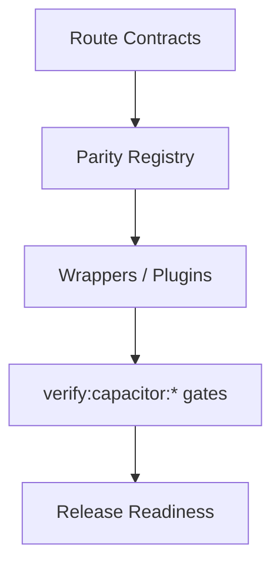

# Capacitor Parity Audit


## Visual Map



This is the release-gate contract for calling iOS/Android parity complete.

## Source Of Truth

- Canonical app routes: `hushh-webapp/lib/navigation/routes.ts`
- Route governance reference: `docs/reference/architecture/route-contracts.md`
- Mobile parity reference: `docs/reference/mobile/capacitor-parity-audit.md`
- Docs/runtime verification: `bash scripts/ci/docs-parity-check.sh`
- Full CI lane: `bash scripts/ci/orchestrate.sh all`

## Required Local Command

```bash
bash scripts/ci/orchestrate.sh all
```

The audit must pass as one lane, not as a hand-waved collection of partial checks.

## Route Classification Policy

Every visible page in the canonical app route contract must be classified in the parity docs as one of:

- native-supported and required
- intentionally web-only and explicitly exempt

Current policy keeps the full visible app surface in scope, including:

- product routes
- `/developers`
- public/auth content routes
- visible labs routes

## Browser API Policy

Route-facing code must not directly own browser-only APIs when a shared wrapper should exist.

Current shared wrappers:

- clipboard: `hushh-webapp/lib/utils/clipboard.ts`
- navigation mutations / external open: `hushh-webapp/lib/utils/browser-navigation.ts`
- local/session storage access: `hushh-webapp/lib/utils/session-storage.ts`
- download/export: `hushh-webapp/lib/utils/native-download.ts`

Direct usage is allowed only in:

- the wrapper files above
- explicitly exempt web-only plugin implementations
- documented accepted exceptions in the mobile docs

## Accepted Exceptions

Current accepted parity exceptions are:

- None.

Cloud-backed vault preference flows are the canonical cross-platform behavior, and Android passkey PRF is part of the parity contract rather than an exception. If a new exception is ever needed, document it in the mobile docs in the same change.

## Native Project Sanity

Parity is not complete until both projects still load structurally:

- iOS: `xcodebuild -list -project ios/App/App.xcodeproj`
- Android: `./gradlew tasks --all`

## Release Standard

Treat docs/runtime drift as a blocker. A route, native contract, or browser-sensitive flow is not parity-ready if the docs and audit registry do not describe it correctly.
