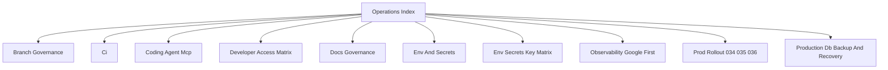

# Operations Index

## Visual Map

Use this as the entrypoint for CI, docs governance, delivery, and environment operations.

## References

- [ci.md](./ci.md): local/remote CI parity and required lanes.
- [branch-governance.md](./branch-governance.md): branch rules, review gates, and bypass policy.
- [docs-governance.md](./docs-governance.md): documentation placement and quality gates.
- [env-and-secrets.md](./env-and-secrets.md): environment and secret contract.
- [env-secrets-key-matrix.md](./env-secrets-key-matrix.md): key-by-key environment matrix.
- [developer-access-matrix.md](./developer-access-matrix.md): org-level developer IAM baseline, runtime identities, and DB access path.
- [observability-google-first.md](./observability-google-first.md): observability operating model.
- [production-db-backup-and-recovery.md](./production-db-backup-and-recovery.md): production DB recovery guide.
- [coding-agent-mcp.md](./coding-agent-mcp.md): coding-agent and MCP operating notes.
