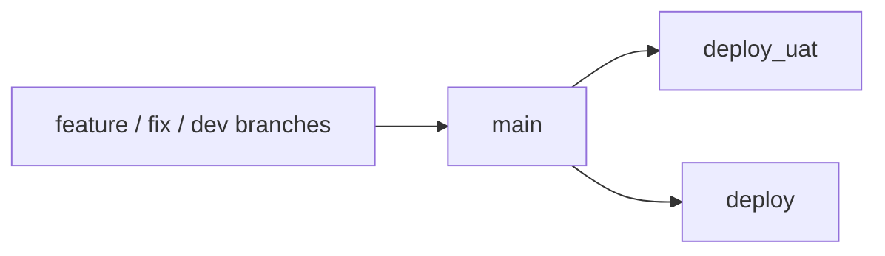

# Branch Governance

## Visual Map

This repo runs on three branch lanes:

| Branch | Purpose | Default policy |
|---|---|---|
| `main` | Team integration branch | Every feature PR targets `main` |
| `deploy_uat` | UAT release lane | Open to approved developers, must contain latest `main` |
| `deploy` | Production release lane | Release-only branch, must contain latest `main` |

## Working Rules

1. Start all development branches from `main`.
2. Merge all feature/fix/docs work back into `main`.
3. Never develop directly on `deploy` or `deploy_uat`.
4. Promote by merging or fast-forwarding the latest `main` into:
   - `deploy_uat` for UAT rollout
   - `deploy` for production release preparation
5. A release branch must contain the latest `origin/main` before deployment.
6. Do not open feature or hotfix PRs directly to `deploy_uat`; promote via `main`.

## Branch Types and Retention

| Branch type | Naming pattern | Retention |
|---|---|---|
| Developer branch | `feature/*`, `feat/*`, `agent_*`, developer-owned names | Keep while active |
| Hotfix branch | `fix/*` | Delete after merge to `main` and successful promotion |
| Promotion PR head | `main` -> `deploy_uat` or `main` -> `deploy` | Keep permanent release branches only |
| Local backup branch | `backup/*`, `publishable/*` | Audit unique commits, salvage if needed, then delete |

Before deleting a local backup branch, classify its unique commits as:

1. already represented in `main`
2. obsolete and safe to drop
3. still valuable and worth promoting onto a fresh salvage branch from current `main`

## Deployment Lanes

### `deploy_uat`

1. Auto-deploys to UAT only after successful `Tri-Flow CI` push runs on `deploy_uat`.
2. Manual dispatch is allowed only as an emergency rerun path.
3. No reviewer gate is required in the workflow itself.
4. Workflow preflight fails if `deploy_uat` does not contain the latest `origin/main`.
5. The intended promotion path is `feature/hotfix -> main -> deploy_uat`.
6. Only `main -> deploy_uat` promotion PRs are valid.

### `deploy`

1. Auto-deploys production only after successful `Tri-Flow CI` push runs on `deploy`.
2. Manual dispatch remains available only as an emergency rerun path.
3. The workflow is valid only from the `deploy` branch.
4. Workflow preflight fails if `deploy` does not contain the latest `origin/main`.
5. The intended promotion path is `feature/hotfix -> main -> deploy`.
6. Only `main -> deploy` promotion PRs are valid.

## Hotfix Playbook

1. Create the hotfix branch from the latest `main`.
2. Merge the hotfix into `main`.
3. Promote `main` into `deploy_uat`.
4. If another blocker appears after that promotion, create a new hotfix branch from the updated `main`.
5. Do not reuse an already-merged hotfix branch for a second fix.

## GitHub Admin Checklist

### `main`

1. Require pull requests before merge.
2. Require the `CI Status Gate` and `Main Freshness Gate` status checks.
3. Block force-pushes.
4. Block branch deletion.
5. Use bypass for the 3 core owners only; do not rely on overlapping push restrictions.
6. Keep ordinary development off `main`; use PRs from developer branches.

Current operating note:

- `enforce_admins` should stay enabled
- verify the live setting with `./scripts/ci/verify-main-branch-protection.sh`

### `deploy`

1. Protect the branch.
2. Require PR merge from `main` only.
3. Require `CI Status Gate` and `Release Lane Gate`.
4. Treat it as release-only.
5. Use bypass only for the 3 core owners.

### `deploy_uat`

1. Protect the branch.
2. Require PR merge from `main` only.
3. Require `CI Status Gate` and `Release Lane Gate`.
4. Keep it synced from `main` before rollout.
5. Use bypass only for the 3 core owners.

## Production Approval Environments

The production workflow uses two GitHub environment names:

| Environment | Intended use |
|---|---|
| `production-approval` | Non-owner deploys, configure required reviewers |
| `production-owner-bypass` | Owner-triggered deploys, no reviewer gate |

Default owner assumption in the workflow:

- `kushaltrivedi`

If ownership changes, update `.github/workflows/deploy-production.yml` and the environment reviewers together.
