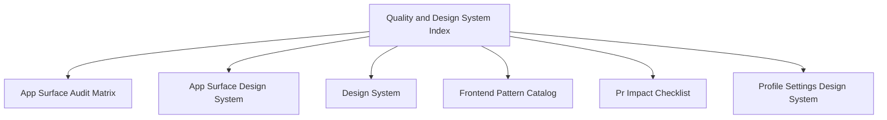

# Quality and Design System Index

## Visual Map

This is the north-star entrypoint for the app shell, surface system, interaction rules, and responsive layout contract.

## Read In This Order

- [design-system.md](./design-system.md): component layering and primitive ownership.
- [app-surface-design-system.md](./app-surface-design-system.md): page shell, header, card, bell, and interaction contract.
- [profile-settings-design-system.md](./profile-settings-design-system.md): canonical grouped settings language.
- [frontend-pattern-catalog.md](./frontend-pattern-catalog.md): implementation patterns and allowed primitives.
- [app-surface-audit-matrix.md](./app-surface-audit-matrix.md): current rollout matrix across routes.
- [pr-impact-checklist.md](./pr-impact-checklist.md): change-impact review checklist.
