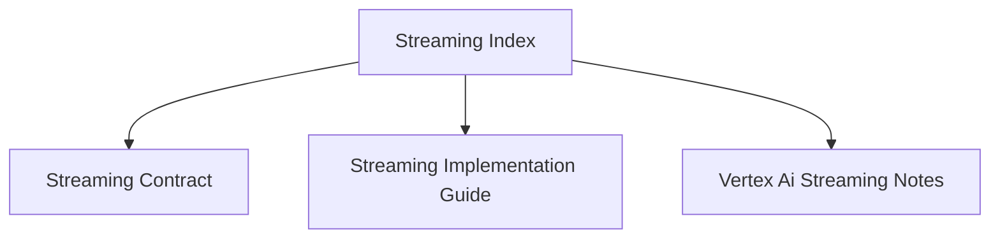

# Streaming Index

## Visual Map

Streaming contracts and implementation notes live here.

## References

- [streaming-contract.md](./streaming-contract.md): canonical event and payload contract.
- [streaming-implementation-guide.md](./streaming-implementation-guide.md): implementation guide.
- [vertex-ai-streaming-notes.md](./vertex-ai-streaming-notes.md): provider-specific notes.
